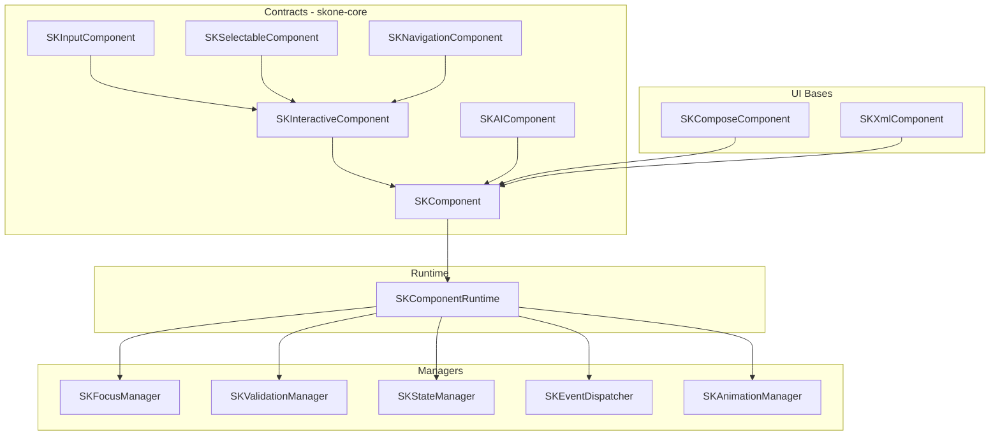

# SKOne Component Framework

Internal framework that every future SKOne widget inherits.
**No production widgets** are defined here — only contracts, managers, and UI bases.

## Architecture

## Contracts

| Contract | Purpose |
|----------|---------|
| `SKComponent` | Identity, config, attach/detach lifecycle |
| `SKInteractiveComponent` | Click, long-click, focus |
| `SKInputComponent<T>` | Value, change events, validation |
| `SKSelectableComponent<T>` | Single/multi selection |
| `SKNavigationComponent` | Destination navigation intent |
| `SKAIComponent` | Component-scoped AI execution |

## Managers

| Manager | Responsibility |
|---------|----------------|
| `SKFocusManager` | Focus ownership across components |
| `SKValidationManager` | Register validators; validate one/all |
| `SKStateManager` | Observe/update `SKComponentState` |
| `SKEventDispatcher` | Typed component events + subscribers |
| `SKAnimationManager` | Motion-token driven animation requests |

## Supporting abstractions

- **Layout** — `SKLayoutSpec`, constraints (framework-agnostic)
- **Icons** — `SKIconProvider` / `SKIconKey` (no drawable coupling in core)
- **Analytics** — `SKAnalyticsHook` emitting via config
- **Plugin lifecycle** — `SKComponentPlugin` hooks on attach/detach/event
- **DSL** — `skComponent { }` builds `SKComponentConfig` fluently

## Compose / XML bases

| Module | Type | Role |
|--------|------|------|
| `skone-compose` | `SKComposeComponent` + `rememberSKComponentRuntime` | Host runtime in composition |
| `skone-xml` | `SKXmlComponent` | View base wired to runtime |

Neither module ships production widgets.

## Related

- [Design System](DESIGN_SYSTEM.md)
- [ADR 0008](adr/0008-component-framework.md)
- [API Guidelines](SDK_API_GUIDELINES.md)
