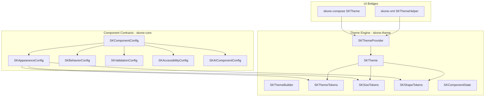

# SKOne Design System (v1.1)

Token-driven visual and interaction language for SKOne.
Widgets (buttons, fields, …) are **not** part of this milestone — only the
shared contracts and theme engine that every future widget will inherit.

## Goals

- Single source of truth for color, type, space, elevation, radius, motion, icons, size, and shape
- Theme engine with Light / Dark / System / Custom resolution
- Shared abstractions for Jetpack Compose and XML Views
- Stable component contracts (appearance, behavior, validation, accessibility, analytics, AI)
- No hardcoded visual values in widget APIs — everything resolves through tokens
- Backward-compatible public APIs (Semantic Versioning)

## Architecture

## Module map

| Module | Responsibility |
|--------|----------------|
| `skone-theme` | Tokens, defaults, size/shape/state systems, theme engine |
| `skone-core` | Component contracts, validation models, AI component config |
| `skone-compose` | Compose theme bridge (`CompositionLocal`, converters) — **no widgets** |
| `skone-xml` | XML/Context theme bridge — **no widgets** |

## Token taxonomy

| Category | Types |
|----------|-------|
| Color | `SKColorTokens`, `SKColorRole` |
| Typography | `SKTypographyTokens`, `SKTypographyRole` |
| Spacing | `SKSpacingTokens` |
| Elevation | `SKElevationTokens`, `SKElevationLevel` |
| Radius | `SKRadiusTokens` |
| Motion | `SKMotionTokens` |
| Icons | `SKIconTokens` |
| Size | `SKSize`, `SKSizeTokens` |
| Shape | `SKShape`, `SKShapeTokens` |

Aggregate: `SKThemeTokens` + size/shape on `SKTheme`.

## Theme engine

1. **Defaults** — `SKThemes.Light` / `SKThemes.Dark` built from default token tables.
2. **Builder** — `SKThemeBuilder` for custom themes (override any token category).
3. **Provider** — `SKThemeProvider` / `SKDefaultThemeProvider` resolve mode → theme.
4. **Runtime** — UI bridges expose the active `SKTheme` to Compose and XML.

Dynamic Color (Android 12+) is supported via an optional palette override hook on the
provider; foundation tokens remain the fallback.

## Component contract parameter order

Every future public widget must follow:

1. modifier / layout
2. state / value
3. callbacks
4. content
5. appearance (`SKAppearanceConfig`)
6. behavior (`SKBehaviorConfig`)
7. validation (`SKValidationConfig`)
8. accessibility (`SKAccessibilityConfig`)
9. analytics (`SKAnalyticsConfig`)
10. AI (`SKAIComponentConfig`)

## State system

`SKComponentState` captures enabled, readOnly, focused, pressed, selected, checked,
expanded, loading, and error. Interaction mapping uses `SKInteractionState`.

Widgets resolve colors/elevation from tokens **and** state — never from raw literals.

## Size and shape systems

- `SKSize`: ExtraSmall → ExtraLarge (+ `SKSizeTokens` for height/padding/icon/minTouchTarget)
- `SKShape`: Rectangle, Circle, Rounded(radius from tokens)
- `SKShapeTokens`: none → full, mapped to radius tokens

## Compose & XML

| Concern | Compose (`skone-compose`) | XML (`skone-xml`) |
|---------|---------------------------|-------------------|
| Provide theme | `SKTheme { }` + `LocalSKTheme` | `SKThemeHelper.install(context, theme)` |
| Read tokens | `LocalSKTheme.current.tokens` | `SKThemeHelper.require(context).tokens` |
| Convert types | `SKColor.toColor()`, `SKDp.toDp()` | `SKColor.toArgb()`, dimension helpers |

No production widgets in either module for v1.1.

## Extensibility

- Custom themes: implement token interfaces or use `SKThemeBuilder`
- Custom validators: `SKValidator<T>`
- Custom AI: `SKAIProvider` + `SKAIComponentConfig`
- Plugins: remain orthogonal via `skone-plugin`

## Related docs

- [SDK API Guidelines](SDK_API_GUIDELINES.md)
- [ADR 0005 — Theme Token Interfaces](adr/0005-theme-token-interfaces.md)
- [ADR 0007 — Design System Theme Engine](adr/0007-design-system-theme-engine.md)
