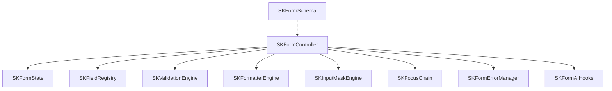

# SKOne Form Framework

Reusable form infrastructure consumed by production inputs such as `SKTextField`.

## Architecture



## Key types

| Type | Role |
|------|------|
| `SKFormController` | Orchestrates lifecycle, submit, reset, field updates |
| `SKFormState` | Idle / Editing / Validating / Submitting / Submitted / Error |
| `SKFieldRegistry` | Registers logical fields by id |
| `SKFormField` | Field descriptor (value, rules, formatter, mask, AI) |
| `SKValidationEngine` | Runs `SKValidationRule` trees |
| `SKFormatterEngine` | Display ↔ model value conversion |
| `SKInputMaskEngine` | Pattern-based input masking |
| `SKFocusChain` | Tab / next-field order |
| `SKFormErrorManager` | Aggregated field + form errors |
| `SKFormSchema` | Dynamic form model interfaces (JSON schema–shaped) |
| `SKFormAIHooks` | AI assist hooks per field / form |

## Usage (infrastructure only)

```kotlin
val controller = SKFormController.create()
controller.register(
    SKFormField(
        id = "email",
        initialValue = "",
        rules = listOf(SKRequiredRule(), SKEmailRule()),
        formatter = SKTrimFormatter,
    ),
)
controller.updateValue("email", "user@example.com")
val result = controller.validate()
controller.submit() // validates then transitions state
```

`SKTextField` / `SKTextFieldView` call `controller.updateRawInput` / `requestFocus` and auto-register — they do not own validation logic.

## Related

- [ADR 0010](adr/0010-form-framework.md)
- [SKTextField Widget](WIDGETS_SKTEXTFIELD.md)
- [Component Framework](COMPONENT_FRAMEWORK.md)
- [API Guidelines](SDK_API_GUIDELINES.md)
