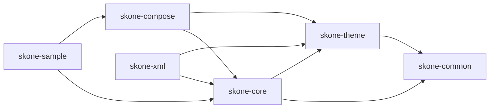
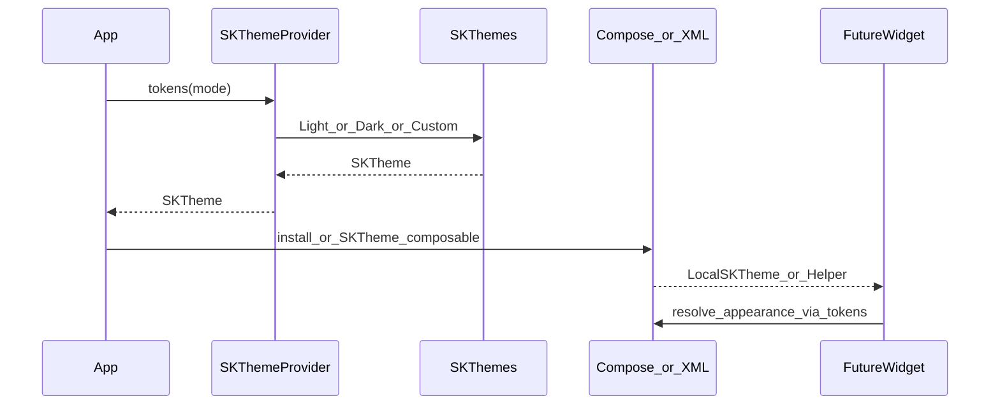
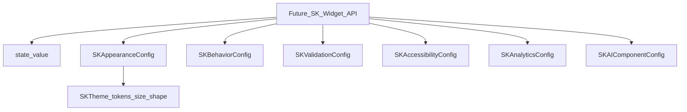

# SKOne Design System Architecture

## Dependency flow

```mermaid
flowchart LR
  common[skone-common]
  theme[skone-theme]
  core[skone-core]
  compose[skone-compose]
  xml[skone-xml]
  sample[skone-sample]

  theme --> common
  core --> theme
  core --> common
  compose --> theme
  compose --> core
  xml --> theme
  xml --> core
  sample --> compose
  sample --> core
```

## Theme resolution

```mermaid
sequenceDiagram
  participant App
  participant Provider as SKThemeProvider
  participant Themes as SKThemes
  participant Bridge as Compose_or_XML
  participant Widget as FutureWidget

  App->>Provider: tokens(mode)
  Provider->>Themes: Light_or_Dark_or_Custom
  Themes-->>Provider: SKTheme
  Provider-->>App: SKTheme
  App->>Bridge: install_or_SKTheme_composable
  Bridge-->>Widget: LocalSKTheme_or_Helper
  Widget->>Bridge: resolve_appearance_via_tokens
```

## Component config layers

```mermaid
flowchart TB
  WidgetAPI[Future_SK_Widget_API]
  WidgetAPI --> State[state_value]
  WidgetAPI --> Appearance[SKAppearanceConfig]
  WidgetAPI --> Behavior[SKBehaviorConfig]
  WidgetAPI --> Validation[SKValidationConfig]
  WidgetAPI --> A11y[SKAccessibilityConfig]
  WidgetAPI --> Analytics[SKAnalyticsConfig]
  WidgetAPI --> AI[SKAIComponentConfig]
  Appearance --> Theme[SKTheme_tokens_size_shape]
```
