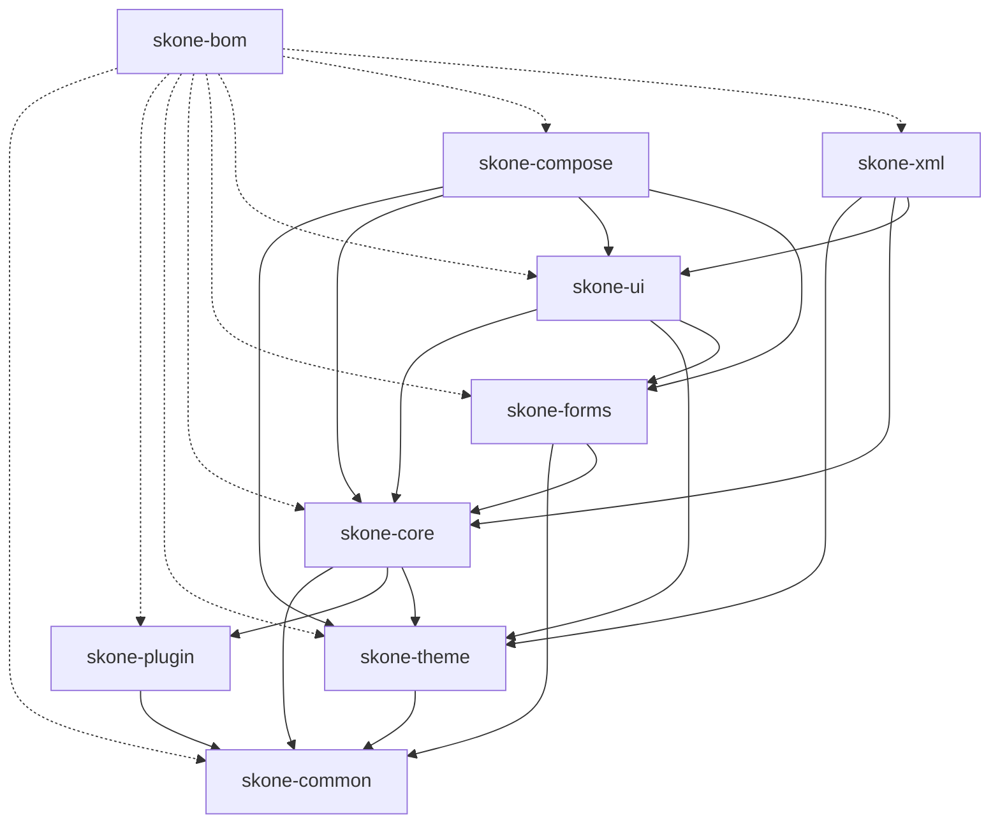
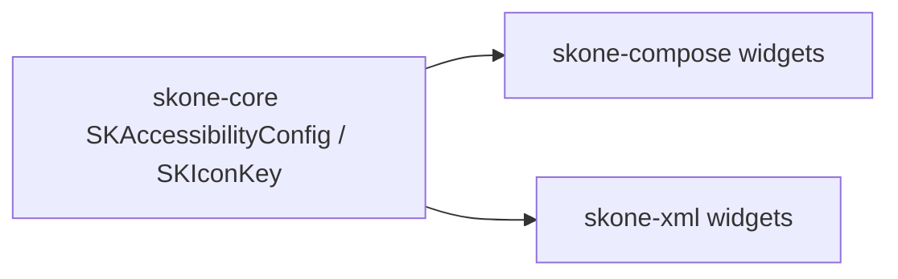
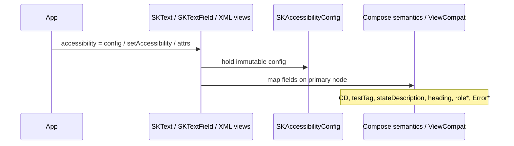
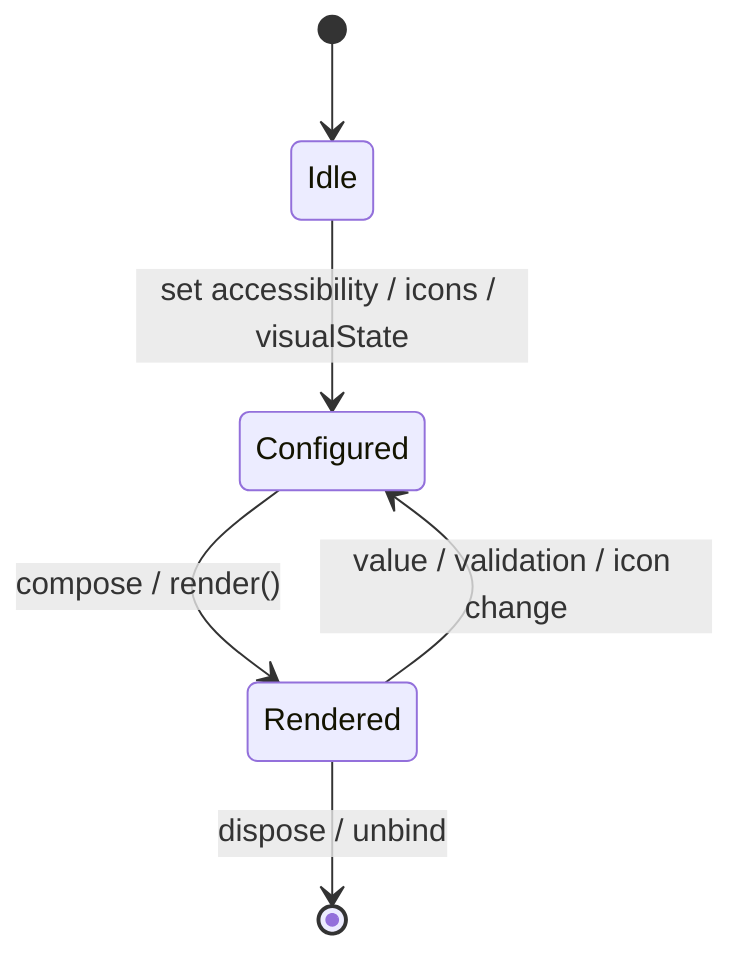
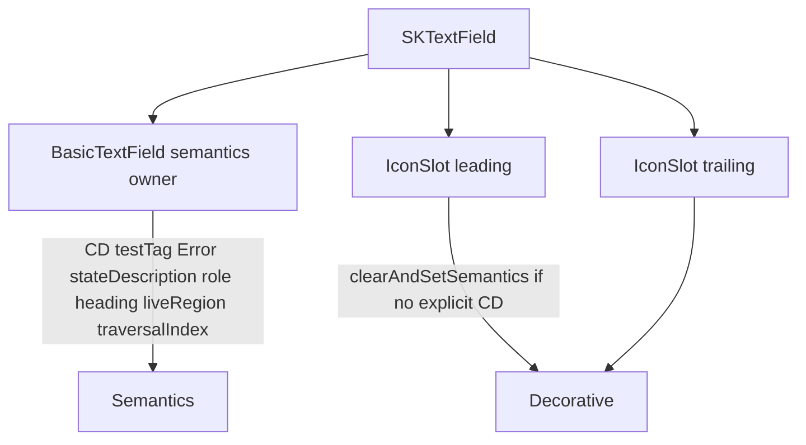
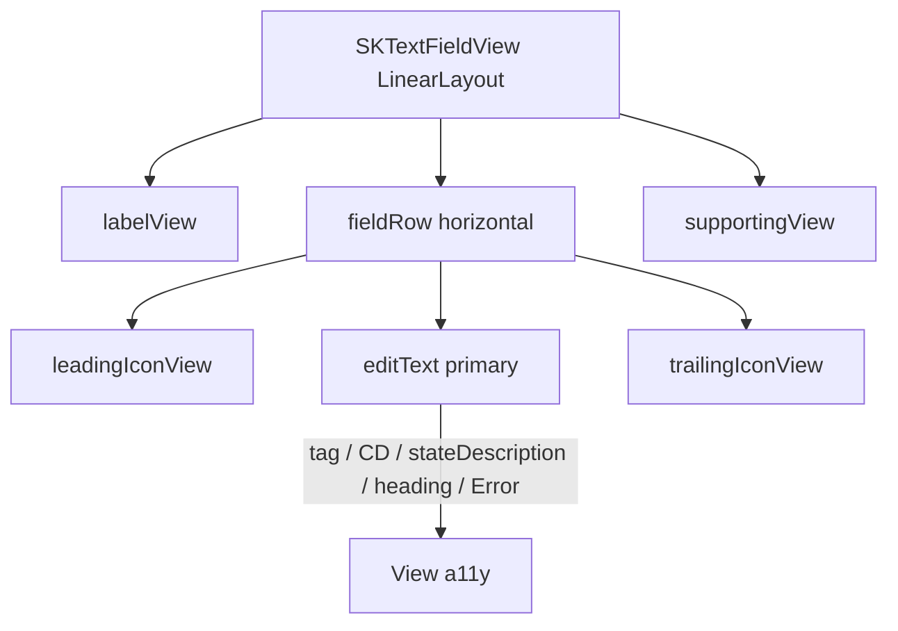

# Next phase design — Flagship accessibility & dual-surface parity

**Baseline:** `1.4.0-alpha01` (published, externally verified)  
**Status:** Development design (not a release claim)  
**Capability:** Close deferred accessibility / Compose↔XML gaps on existing flagship widgets (`SKText`, `SKTextField`) without introducing a new widget module.

---

## 1. Current architecture

SKOne is a multi-module Android design/component library:

| Module | Role |
|--------|------|
| `skone-common` | Result / error / logger / OptIn annotations |
| `skone-plugin` | Plugin SPI |
| `skone-theme` | Design tokens + theme engine |
| `skone-core` | `SKOne` init, AI SPI, component framework, `SKAccessibilityConfig` |
| `skone-forms` | Form controller, validation, focus chain |
| `skone-ui` | UI-agnostic `SKText` / `SKTextField` contracts |
| `skone-compose` | Compose theme bridge + production widgets |
| `skone-xml` | XML theme bridge + production widgets |
| `skone-bom` | Version alignment |

Flagship consumer path (Compose): `skone-bom` + `skone-compose` → transitive theme/core/ui/forms.

---

## 2. Problem being solved

`1.4.0-alpha01` unified Compose `SKTextField` primary-node accessibility and documented honest gaps in `docs/ACCESSIBILITY.md`. Several **deferred** items remain:

1. **XML `testTag`** and most of `SKAccessibilityConfig` are stored but not applied.
2. **Compose `IconSlot`** always creates a separate TalkBack node (`contentDescription = key.contentDescription ?: key.key`), including raw key noise.
3. **Compose `SKText`** does not apply `stateDescription` / `role` (while TextField already maps role).
4. **XML leading/trailing icons** update the component model but **never render**.
5. Framework docs still under-claim widget maturity in places.

These are not “missing widgets”; they are **incomplete contracts** on the library’s flagship surfaces. Leaving them open undermines Compose/XML consistency and a11y honesty before adding `SKButton` or new modules.

---

## 3. Why this capability is next

| Candidate | Verdict |
|-----------|---------|
| **A11y + dual-surface parity (this)** | Highest immediate product value: finishes documented deferred work, strengthens reusable contracts, improves Compose/XML consistency, no new module |
| `SKButton` | High future value, but builds on uneven a11y/XML baseline |
| Form schema JSON binder | Experimental SPI only; not the top consumer pain after alpha01 |
| Concrete `skone-ai-*` | SPI exists; premature without flagship UI polish |
| Focus-chain skip disabled/readOnly | **Contract change** — explicitly deferred (see Non-goals) |

Roadmap items 1–7 (design system → playground/docs) are largely **implemented**. The next meaningful step is quality/parity on what already ships.

---

## 4. Goals

1. Apply `SKAccessibilityConfig.testTag` on XML widgets in a testable way.
2. Apply high-value XML a11y: `stateDescription`, `heading`, Error on the primary editable where View APIs allow.
3. Make Compose `IconSlot` **decorative by default**; announce only when `SKIconKey.contentDescription` is explicitly non-blank.
4. Wire Compose `SKText` `stateDescription` + `role` consistently with TextField’s role map.
5. Render XML `SKTextFieldView` leading/trailing icons (visual parity with Compose slots).
6. Update `ACCESSIBILITY.md` / widget docs to match reality.
7. Preserve OptIn-free flagship APIs and existing primary-node Compose semantics model.

---

## 5. Non-goals

- New widgets (`SKButton`, password field, …)
- New Gradle modules / BOM entries
- Changing focus-chain default (no skip for disabled/readOnly)
- Flipping Compose TextField to `mergeDescendants = true` by default (conflicts with primary-node ownership)
- Formal japicmp/BCV gate
- Version bump, publish, tag, push
- Changing `samples/skone-demo` off Maven Central `1.4.0-alpha01` (demo remains published-consumer proof)
- Rewriting Experimental schema / component DSL
- Dynamic Color Material You helper

---

## 6. API design

### Existing public types (unchanged shape)

`SKAccessibilityConfig` already exposes:

- `contentDescription`, `stateDescription`, `testTag`, `role`, `heading`, `liveRegion`, `traversalIndex`, `mergeDescendants`

**No new config properties** in this phase.

### Compose — behavior changes (signatures unchanged)

| API | Change |
|-----|--------|
| `SKText(...)` | Apply `stateDescription`, `role` when set; keep `mergeDescendants` / `heading` / `testTag` / CD |
| `SKTextField(...)` | IconSlot semantics only; field signature unchanged |
| `IconSlot` (private) | Decorative unless explicit non-blank `SKIconKey.contentDescription` |

Optional Compose wiring (additive behavior):

- `liveRegion == true` → `LiveRegionMode.Polite` on the semantics owner
- `traversalIndex` → Compose `traversalIndex` when non-null

**TextField `mergeDescendants`:** remain **not applied** on the primary editable node (documented). Applying it risks merging decoration/label into the editable node and breaking the alpha01 primary-node contract.

### XML — additive public surface

| API | Responsibility |
|-----|----------------|
| `SKTextView.setAccessibility(SKAccessibilityConfig)` | Replace a11y config and re-render |
| `SKTextFieldView.setAccessibility(SKAccessibilityConfig)` | Same for field |
| Attr `app:skTestTag` | Populate `testTag` from XML |
| Existing `setLeadingIcon` / `setTrailingIcon` | Now **render** icons + call `render()` |

**XML `testTag` semantics:** store in config; apply as `View.setTag(testTag)` on the **primary** interactive view (`SKTextView` itself; `SKTextFieldView.input`). Document that Espresso `withTagValue` / Robolectric `tag` assert against that tag. This is the View-world analogue of Compose `Modifier.semantics { testTag = … }` — not an Android framework “testTag” property.

**XML Error:** when `visualState == Error`, set `AccessibilityNodeInfo.setError` on the primary editable via an accessibility delegate (or `ViewCompat` helpers where available), using supporting/error text.

**XML `stateDescription` / `heading`:** `ViewCompat.setStateDescription` / `ViewCompat.setAccessibilityHeading` on the primary view.

**Root vs input TalkBack:** keep applying contentDescription to root + input for this phase (existing tests/contracts). Do not flip root to `NO` without a dedicated contract review.

### Lifecycle / state / threading

- Config is immutable data held on the widget / component; applied on compose recomposition or XML `render()`.
- Main-thread UI only (Compose/XML as today).
- No new shared mutable global state.

### Extensibility

- Future widgets reuse the same `SKAccessibilityConfig` + IconSlot decorative rule.
- Role string map remains a private Compose helper (shared file), not a public enum, to avoid premature taxonomy lock-in.

### Binary / source compatibility

- Flagship Compose function signatures: **unchanged**.
- XML: additive methods/attrs only.
- Soft behavior change: IconSlot no longer announces `key.key` when CD is null — **intentional a11y fix**; apps that relied on raw key announcement should set `SKIconKey.contentDescription`.

---

## 7. Module ownership

| Concern | Module |
|---------|--------|
| `SKAccessibilityConfig` | `skone-core` (unchanged) |
| `SKIconKey` | `skone-core` (unchanged; CD semantics clarified in KDoc) |
| Compose semantics + IconSlot | `skone-compose` |
| XML attrs + View wiring + icon row | `skone-xml` |
| Docs | `docs/`, `docs-site/` as needed |
| Playground (optional showcase) | `samples/skone-playground` |
| Demo | **unchanged** (Central pin) |

---

## 8. Dependency flow

No new module edges. Direction remains:

`common ← plugin/theme ← core ← forms/ui ← compose/xml`

---

## 9. Runtime / data flow

\*role on Compose; Error/stateDescription/heading/testTag on XML primary as implemented.

---

## 10. State flow

Form validation → `visualState` / supporting text → Error semantics on primary editable (Compose already; XML this phase).

---

## 11. Compose flow

---

## 12. XML / View flow

---

## 13. Accessibility considerations

- Preserve Compose TextField **primary-node ownership** (alpha01 contract).
- Required: visual `*` + `stateDescription` includes `"Required"` without rewriting explicit CD.
- Icon default: decorative (silent). Explicit `SKIconKey.contentDescription` → announce that string only.
- XML `testTag` is for automation; not a TalkBack string.
- Document remaining gaps: TextField `mergeDescendants`, focus skip, full live-region policy on XML if not fully portable.

---

## 14. Error handling

- Invalid / unknown `role` strings: ignore (Compose TextField already).
- Missing theme (`SKThemeHelper`): existing behavior.
- Null icon keys: hide icon views.
- Accessibility delegate failures: do not crash render; best-effort apply.

---

## 15. Testing strategy

| Surface | Tests |
|---------|-------|
| Compose IconSlot | androidTest: with leading icon + null CD → no extra node with key string; with explicit CD → node exists |
| Compose SKText | androidTest or unit if practical: stateDescription / role applied |
| XML testTag | Robolectric: attr + `setAccessibility` → `input.tag` / view.tag |
| XML stateDescription / heading | Robolectric + ViewCompat getters |
| XML Error | Robolectric: Error visualState → AccessibilityNodeInfo error (via createAccessibilityNodeInfo) |
| XML icons | Robolectric: setLeadingIcon → leading child visible with glyph |
| Regression | Existing SKTextFieldAccessibilityTest, XML contract tests |

Hardening: near-miss tags/CDs, required+custom stateDescription combine, icon key without CD must not leak key into TalkBack tree.

---

## 16. Backward compatibility

- Source-compatible for OptIn-free Compose apps.
- XML additive APIs.
- Soft a11y behavior change for IconSlot (raw key no longer announced).
- Demo remains on published Central artifacts (will not show unpublished a11y until next publish).

---

## 17. Migration considerations

| If you… | Do this |
|---------|---------|
| Needed IconSlot to speak the icon key | Pass `SKIconKey("…", contentDescription = "Close")` |
| Use XML UI tests | Prefer `app:skTestTag` / `setAccessibility(testTag=…)` and assert primary view tag |
| Relied on unused config fields | After this phase, treat newly SUPPORTED matrix rows as real |

---

## 18. Future extensibility

- `SKButton` inherits IconSlot decorative rule + config mapping helpers.
- Optional later: focus-chain skip **opt-in** policy (separate design).
- Optional later: XML root `IMPORTANT_FOR_ACCESSIBILITY_NO` to end double CD (contract review).
- Optional later: graduate role strings to a public enum if taxonomy stabilizes.

---

## 19. Risks

| Risk | Mitigation |
|------|------------|
| IconSlot silence surprises apps | Document in ACCESSIBILITY + KDoc on `SKIconKey` |
| XML layout change breaks custom styling | Keep public `input` EditText; only wrap in row |
| Error delegate fights AppCompat | Prefer ViewCompat / carefully merge delegates |
| Over-claiming liveRegion | Matrix stays honest; polite only when `liveRegion == true` |

---

## 20. Alternatives considered

| Alternative | Why not now |
|-------------|-------------|
| Build `SKButton` first | Leaves known a11y/XML debt on flagship fields |
| Opt-in focus skip in this phase | Contract-sensitive; needs product approval |
| Enable TextField `mergeDescendants` | Breaks primary-node model / tests |
| New `SKTestTag` type | Unnecessary — string on existing config is enough |
| Force demo onto `project()` deps | Violates external-consumer verification policy |

---

## Implementation checklist (this phase)

1. Compose IconSlot decorative default + tests  
2. Compose SKText stateDescription/role (+ liveRegion/traversalIndex where safe)  
3. Compose TextField liveRegion/traversalIndex on primary node (not mergeDescendants)  
4. XML attrs `skTestTag` + setAccessibility + apply config on render  
5. XML icon row rendering  
6. Docs: ACCESSIBILITY, widget notes, this design (done)  
7. Playground optional; demo unchanged  
8. Validate without version/publish changes  
